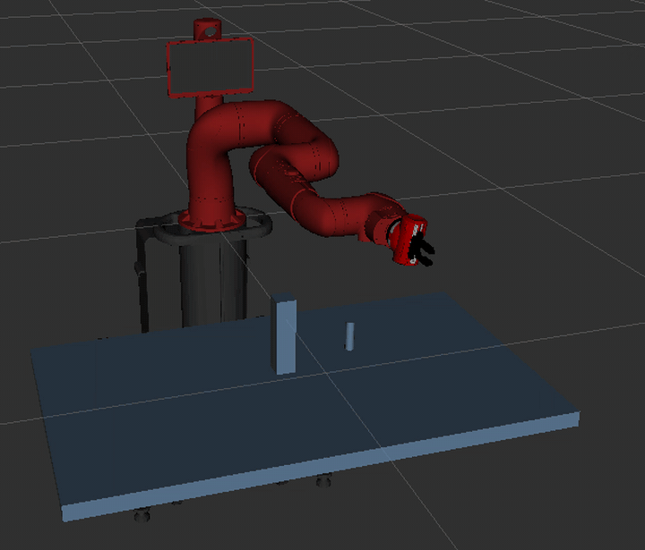
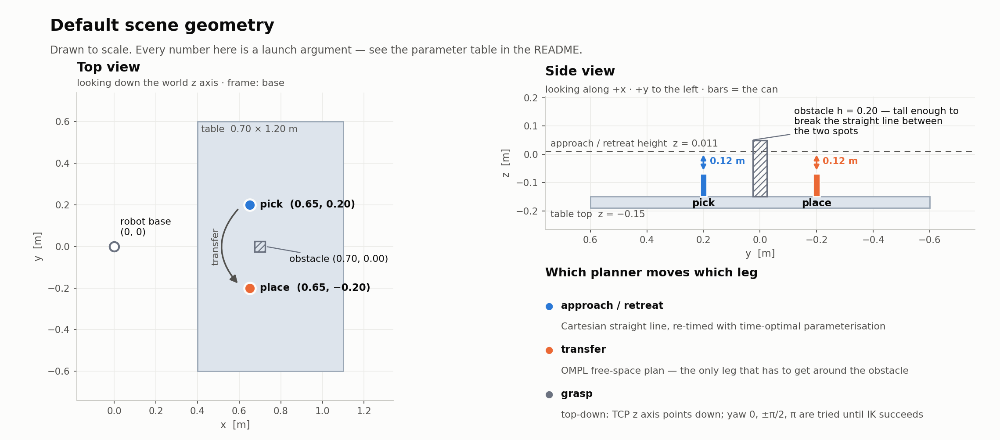
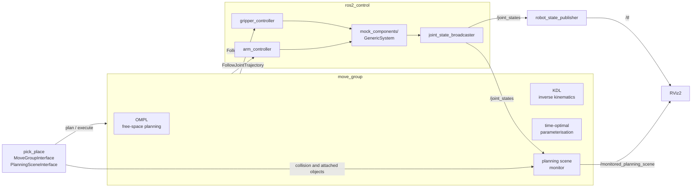
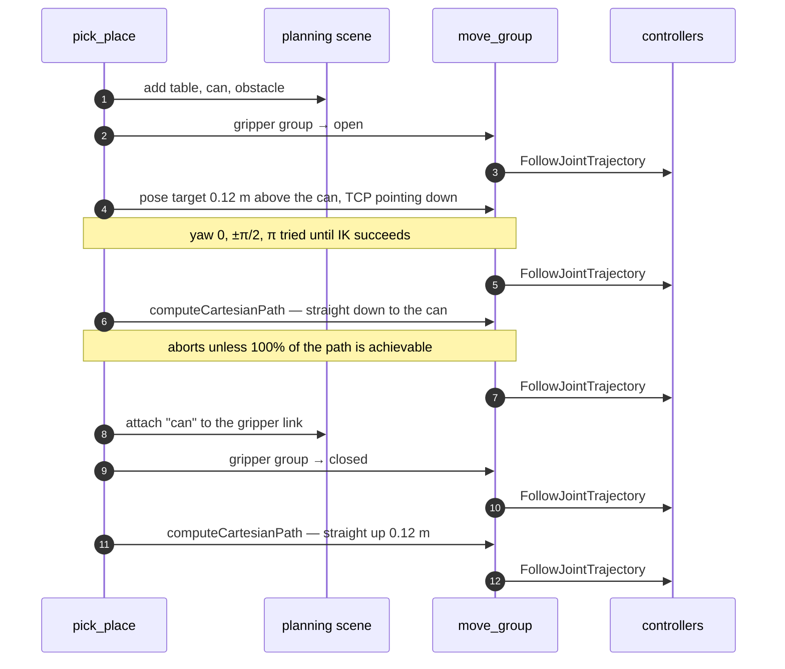

<div align="center">

# Sawyer Pick &amp; Place

**A complete ROS 2 pick-and-place pipeline for the Rethink Robotics Sawyer — MoveIt 2 planning, `ros2_control` execution, and a collision-aware scene, all driven by one configurable node.**

[](https://docs.ros.org/en/humble/)
[](https://moveit.ai/)
[](https://en.cppreference.com/w/cpp/17)
[](LICENSE)



<sub>Recorded from RViz — two full cycles at the default settings, sped up 2.2×.</sub>

</div>

---

## What this is

A Sawyer arm picks a can off a table, carries it past an obstacle, and sets it down on the
other side — then does it again in reverse. It runs entirely in simulation on
`mock_components/GenericSystem`, so no hardware is needed.

The point of the repository is the **node**: `pick_place_node.cpp` is a single, readable
file that does the whole job properly, rather than a scripted sequence of hard-coded joint
angles. It

- builds the collision scene (table, can, obstacle) through the planning scene interface;
- **discovers the gripper by itself** — it reads the SRDF, finds the group that does not
  share joints with the arm, and pulls `open` / `closed` from the named states, falling
  back to the joint limits when those states are missing;
- grasps **top-down**, trying yaw `0`, `±π/2`, `π` until IK succeeds, because the can is
  round and its yaw does not matter;
- moves in **straight lines** for approach and retreat via `computeCartesianPath`, then
  re-times the result with time-optimal trajectory generation;
- **attaches** the can to the gripper link so the planner carries it as part of the robot,
  and detaches it back into the world on release;
- **retries** failed plans — OMPL is randomised, so a second attempt usually succeeds;
- exposes **every number as a launch argument**. Nothing is hard-coded.

## Scene geometry



The obstacle matters. It stands `0.20 m` tall from the table surface, which puts its top at
`z = 0.05` — *above* the `z = 0.011` retreat height. The straight line between the two spots
is blocked, so the transfer leg has to be a real free-space plan rather than a slide across
the table.

## How the pieces fit together



Both controllers are `JointTrajectoryController`s: the arm drives `right_j0 … right_j6`,
the gripper drives `right_gripper_l_finger_joint` (the right finger mimics it).

## One pick, step by step



Placing is the mirror image: move above the target, straight down, open, detach, straight
up. After the last cycle the arm plans back to the configuration it started in.

## Requirements

- Ubuntu 22.04 with [ROS 2 Humble](https://docs.ros.org/en/humble/Installation.html)
- MoveIt 2 and the `ros2_control` stack:

  ```bash
  sudo apt install ros-humble-moveit ros-humble-ros2-control \
                   ros-humble-ros2-controllers ros-humble-joint-trajectory-controller \
                   ros-humble-xacro python3-vcstool python3-colcon-common-extensions
  ```

## Getting started

Sawyer's description packages are still ROS 1 catkin packages, so they are fetched rather
than vendored, then ported in place by the script included here.

```bash
# 1. workspace
mkdir -p ~/sawyer_ws && cd ~/sawyer_ws
git clone https://github.com/tathagata48/sawyer_rethink_moveit2_pick_place.git .

# 2. upstream descriptions (Rethink's, unmodified)
vcs import src < sawyer_ws.repos

# 3. convert the catkin description packages to ament_cmake
./port_catkin_descriptions.sh

# 4. build
rosdep install --from-paths src --ignore-src -r -y
colcon build --symlink-install
source install/setup.bash
```

Then, in two terminals:

```bash
# terminal 1 — robot, controllers, move_group, RViz
ros2 launch rethink_moveit_config demo.launch.py

# terminal 2 — the pick and place itself
ros2 launch rethink_pick_place pick_place.launch.py
```

Wait for RViz to finish loading before starting the second one; the node needs
`move_group` and a live `/joint_states` before it can plan.

### Variations

```bash
# four moves instead of two
ros2 launch rethink_pick_place pick_place.launch.py cycles:=4

# no obstacle, and faster
ros2 launch rethink_pick_place pick_place.launch.py add_obstacle:=false velocity_scaling:=0.8

# move the can further apart
ros2 launch rethink_pick_place pick_place.launch.py pick_y:=0.30 place_y:=-0.30

# everything there is to set
ros2 launch rethink_pick_place pick_place.launch.py --show-args
```

## Parameters

Every one of these is a launch argument and a ROS parameter on the node.

| Parameter | Default | Meaning |
|---|---|---|
| `arm_group` | `arm` | planning group of the arm |
| `tcp_link` | `right_gripper_tip` | link placed at the grasp point; its z axis is the approach axis |
| `pick_x` / `pick_y` | `0.65` / `0.20` | where the can starts [m] |
| `place_x` / `place_y` | `0.65` / `-0.20` | where it is put down [m] |
| `table_top_z` | `-0.15` | table surface height [m] |
| `table_x` | `0.75` | table centre, x [m] |
| `table_size_x` / `table_size_y` | `0.70` / `1.20` | table depth and width [m] |
| `can_radius` / `can_height` | `0.012` / `0.08` | can size [m]; the radius must fit the open gripper |
| `approach_distance` | `0.12` | length of the straight approach and retreat [m] |
| `add_obstacle` | `true` | place a box between pick and place |
| `obstacle_height` | `0.20` | its height [m] |
| `cycles` | `2` | number of moves; the can shuttles back and forth |
| `velocity_scaling` | `0.4` | speed of free-space moves, `(0, 1]` |
| `line_speed` | `0.2` | speed of the straight approach and retreat, `(0, 1]` |

The node validates what it is given: non-positive can dimensions, `cycles < 1`, and a
`velocity_scaling` outside `(0, 1]` are rejected before anything moves.

## Repository layout

```
sawyer_ws/
├── port_catkin_descriptions.sh    ROS 1 catkin → ROS 2 ament_cmake, for description packages
├── sawyer_ws.repos                upstream sources, pinned
├── docs/                          demo gif and scene diagram
└── src/
    ├── rethink_pick_place/        the application
    │   ├── src/pick_place_node.cpp
    │   └── launch/pick_place.launch.py
    └── rethink_moveit_config/     MoveIt configuration for Sawyer
        ├── config/                SRDF, kinematics, OMPL, controllers, joint limits
        └── launch/                demo.launch.py and friends
```

`src/sawyer_robot` and `src/intera_common` appear after `vcs import` and are deliberately
untracked — they are Rethink's, pinned in `sawyer_ws.repos`.

## Notes on the configuration

A few values in `rethink_moveit_config` were tuned rather than left at the Setup Assistant
defaults:

- **`longest_valid_segment_fraction: 0.001`** for the arm (OMPL default is `0.005`).
  Collision checking samples every 0.1 % of the state-space extent along a motion, which
  stops the thin gripper fingers from clipping the corner of the obstacle between samples.
- **`gripper_controller`** drives only `right_gripper_l_finger_joint`; the right finger is
  a mimic joint and must not be commanded directly.
- The SRDF carries named states `gripper_open` / `gripper_close`. The node looks for states
  called `open` / `closed` first and falls back to the joint limits, so it works whether or
  not those names are present.

## Porting the ROS 1 descriptions

`port_catkin_descriptions.sh` walks every catkin package in `src/` and, for the ones that
carry a `urdf/` or `meshes/` directory, rewrites `package.xml` and `CMakeLists.txt` as
`ament_cmake` packages that install their resource directories. Everything else — message
packages, metapackages — gets a `COLCON_IGNORE`. The originals are kept alongside as
`package.xml.ros1` and `CMakeLists.txt.ros1`, so the conversion is reversible, and the
script is idempotent.

It finishes by listing every package referenced from the xacro and URDF files, which is a
quick way to see whether anything is still missing.

## Troubleshooting

| Symptom | Cause |
|---|---|
| `No joint states. Is demo.launch.py running?` | the node started before `demo.launch.py` was up — wait for RViz |
| `Straight line blocked (collision or unreachable)` | `computeCartesianPath` returned under 100 %; the approach is obstructed or outside the workspace. Try a smaller `approach_distance` or move the pick/place spots |
| `No reachable top-down pose above (…)` | IK failed at all four yaws; the target is out of reach — pull it closer in x |
| `TCP link '…' not in the robot model` | `tcp_link` does not exist; check the link names in the URDF |
| Planning fails intermittently | expected with OMPL. The node already retries three times; raising `velocity_scaling` or widening the gap between pick and place helps |

## Running on real hardware

Everything above targets the mock hardware interface. On a real Sawyer, replace the
`mock_components/GenericSystem` plugin in
`src/rethink_moveit_config/config/sawyer.ros2_control.xacro` with a hardware interface that
talks to the robot, and point `moveit_controllers.yaml` at the controllers it exposes. The
node itself needs no changes — it only ever talks to `move_group`.

## Licence and credits

This repository is licensed under [Apache-2.0](LICENSE).

The Sawyer description and the Intera tool descriptions are Rethink Robotics' work, fetched
unmodified via `sawyer_ws.repos` and used under their own licences:

- [RethinkRobotics/sawyer_robot](https://github.com/RethinkRobotics/sawyer_robot)
- [RethinkRobotics/intera_common](https://github.com/RethinkRobotics/intera_common)

Built with [MoveIt 2](https://moveit.ai/) and [ros2_control](https://control.ros.org/).
